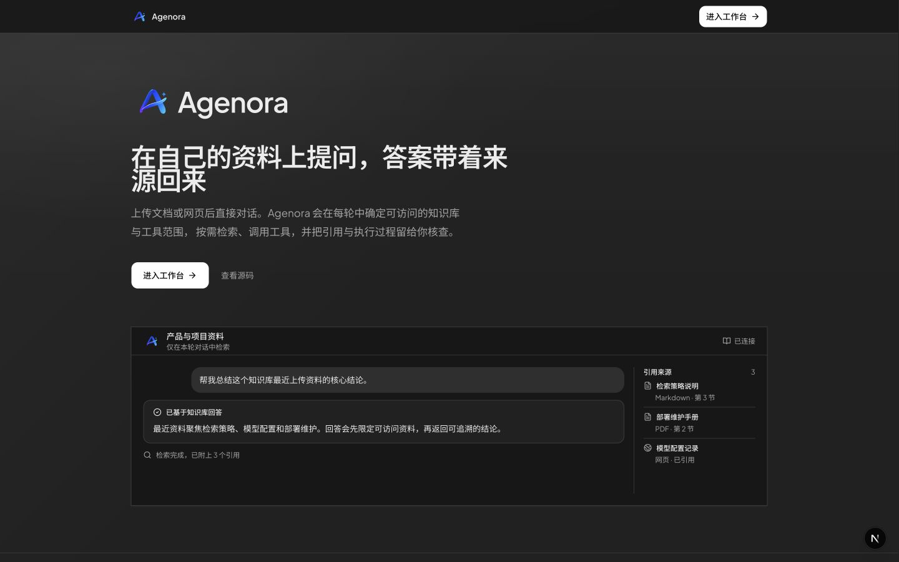
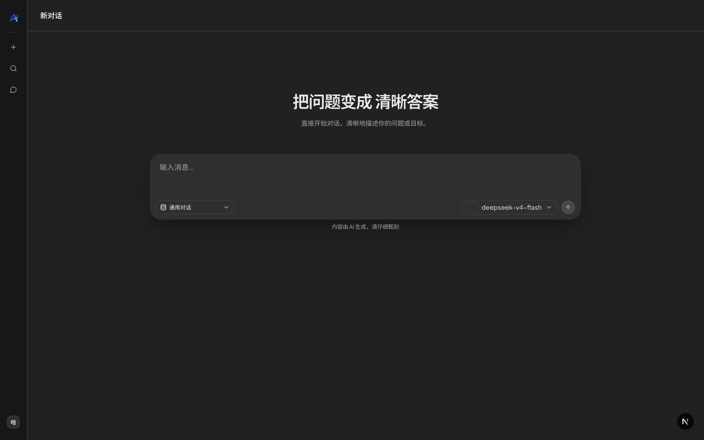
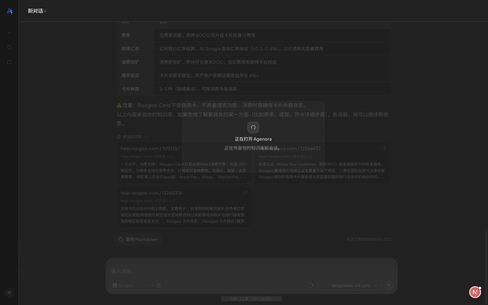
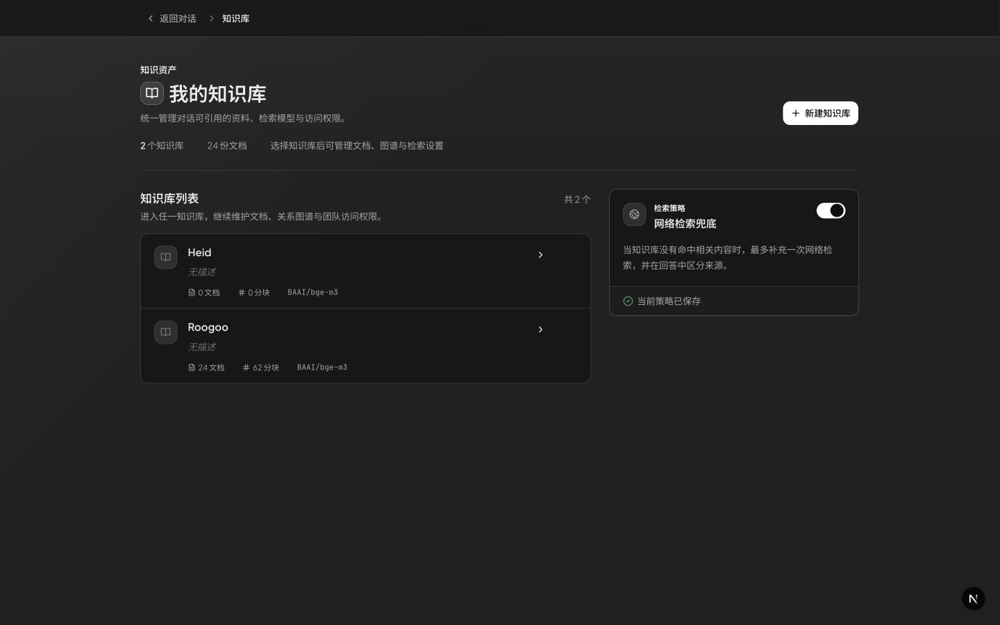
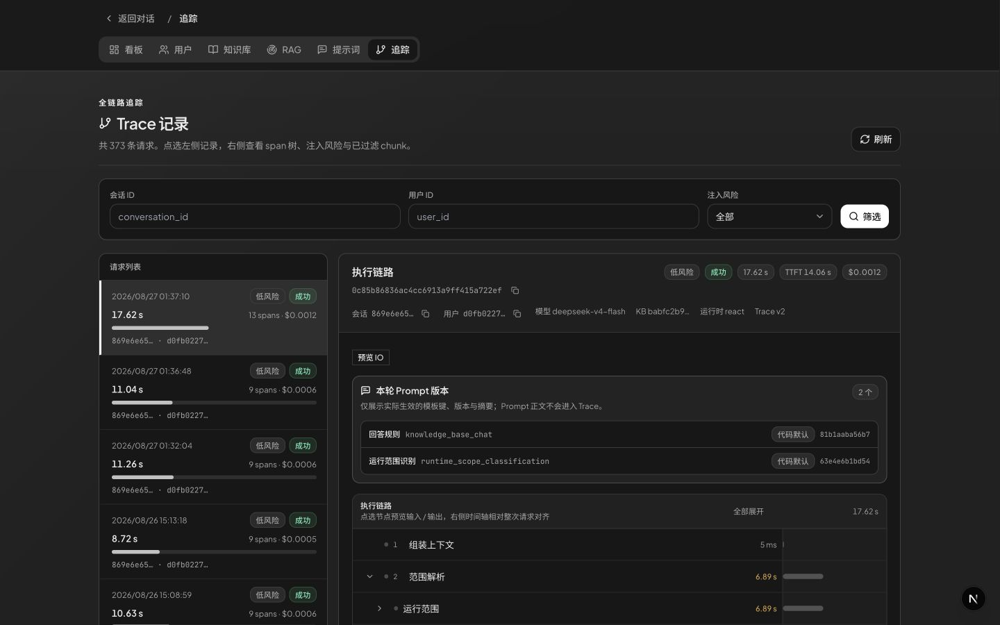
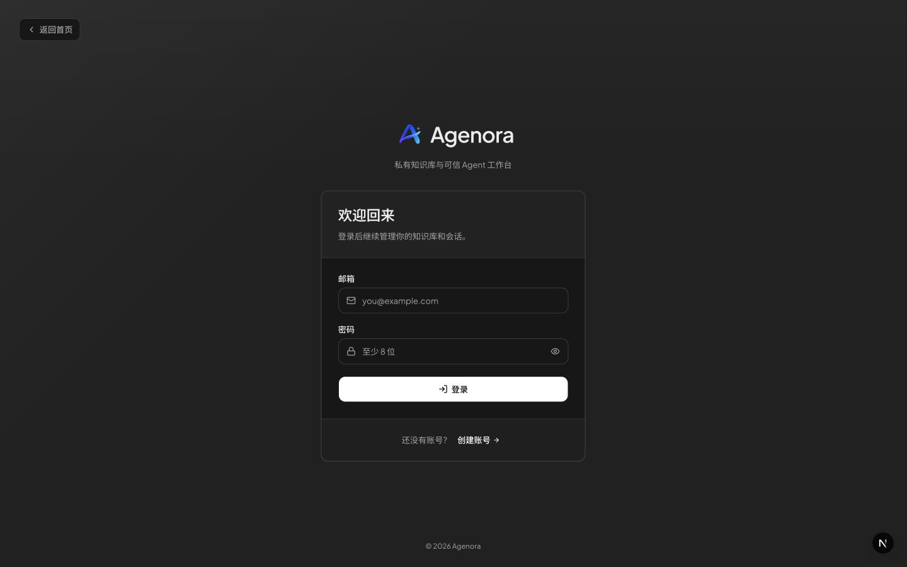

# Agenora

个人项目：私有 RAG 知识库 + 可观测的受约束单 Agent ReAct 执行。

上传文档 / 抓取网页 → 用自然语言提问。系统先确定本轮允许的知识库与工具范围，再由单一 ReAct Agent 按需检索、调用工具与生成回答；答案带原文引用，范围判定、检索与工具调用过程可见。

## 界面预览

下列画面均来自当前界面，统一以深色主题呈现。

<p align="center">
  
</p>

| 新建对话工作区 | 知识库回答与引用 |
|---|---|
|  |  |

| 知识库管理与检索兜底 | Trace 执行链路 |
|---|---|
|  |  |

居中登录页：

<p align="center">
  
</p>

## 能做什么

- **私有知识库** — PDF / Markdown / Word / 网页，按账号隔离
- **混合检索** — 关键词 + 向量，可选 cross-encoder 重排
- **受约束单 Agent ReAct** — 规则、triage、complex、回退共同决定本轮权限、知识库与工具；Agent 在预算内自主调用能力
- **MCP 执行示例** — 本地订单服务经 stdio MCP 对接；订单读取按当前登录用户隔离，退款采用“创建确认单 → 用户二次确认 → 幂等执行”
- **可观测执行过程** — 思考链展示任务路由、工具调用、耗时与命中来源
- **BYOK** — 自带 LLM / Embedding Key，数据留在你的部署环境
- **协作** — 知识库成员可通过邮箱邀请加入

## 技术栈

| 层 | 技术 |
|---|---|
| 前端 | Next.js 16 · React 18 · Tailwind |
| 后端 | FastAPI · LangGraph · SQLAlchemy |
| 存储 | SQLite / PostgreSQL · 本地 Milvus Lite 或生产 Qdrant · 可选 LightRAG/Neo4j |

## 启动方式

| 场景 | 推荐命令 | 存储与服务 |
|---|---|---|
| 日常开发 | `./scripts/dev.sh` | SQLite + Milvus Lite，不需要 Docker |
| Docker 本地验证 | `./scripts/deploy.sh` | PostgreSQL + Qdrant，发布 3000/8000 供调试 |
| HTTPS 生产 | `./scripts/deploy.sh --production` | PostgreSQL + Qdrant + Nginx，仅发布 80/443 |

三种模式的环境文件彼此独立：本地开发使用 `backend/.env`、`frontend/.env`，Docker 使用根目录
`.env`。完整的前置条件、图谱 profile、运维命令和生产证书要求见 [部署说明](docs/deployment.md)。

### 方式一：本地开发（推荐开发时使用）

依赖：Python 3.11、Node.js 20+。本模式使用 SQLite 与 Milvus Lite；不需要 Docker、PostgreSQL、Neo4j 或 LightRAG。

首次安装与配置：

```bash
# 后端
cd backend
python3.11 -m venv .venv
source .venv/bin/activate
pip install -e '.[milvus]'
cp .env.example .env

# 前端
cd ../frontend
npm ci
cp .env.example .env
```

然后在项目根目录同时启动两个服务：

```bash
./scripts/dev.sh
```

- 前端：<http://localhost:3000>
- 后端健康检查：<http://localhost:8000/health>
- 停止：在运行脚本的终端按 `Ctrl+C`。

模型上下文、实验室名称和 Logo 由 [`@opencode-ai/models`](https://models.dev/) 的离线快照提供；升级该依赖后执行以下命令，并提交生成的 `backend/config/models.dev.snapshot.json`：

```bash
cd frontend
npm run sync:model-catalog
```

`backend/.env` 中须配置可用的 LLM；知识库检索还须配置 Embedding。没有 Key 时前后端仍可启动并访问界面，但无法完成实际模型对话。本地示例未配置 `LIGHTRAG_BASE_URL`，因此不会启用图谱检索；需要该能力时请改为 Docker 模式，或自行启动 LightRAG 与 Neo4j 后配置该地址。

### 聊天中的知识库入口

`NEXT_PUBLIC_CHAT_KB_SELECTION_MODE` 控制输入框是否展示知识库下拉框，默认值为 `hidden`：新建会话不展示“通用对话”或知识库控件。服务端会先在当前用户有读取权限、且已有向量数据的知识库中进行意图路由；只有判断问题需要内部资料且能高/中置信度选出一个 KB 时，才会自动检索并将会话绑定到该 KB。闲聊、创作、翻译、低置信度或路由失败会保留为通用聊天。

用户也可从知识库详情页点击「基于此知识库提问」，创建一个显式绑定该知识库的会话。只有需要让用户自行选择知识库时，才将该变量设为 `selectable`。显式绑定会在后续请求中沿用已保存的 `kb_id`；自动路由仅作用于当前轮，下一轮会重新判断，避免把一次自动命中误变成永久锁库。

后端通过 `AGENT_ROUTE_MODE=layered` 启用规则 → triage → complex → 回退的运行范围判定。只有判定为知识型问题时，才会在已授权且可检索的候选库中执行 `KB_AUTO_ROUTE_MODE=llm_fallback` 的 KB 选择；普通对话不会为此额外调用模型。明确提到多个知识库、或要求比较与整合时，单轮最多选择 3 个 KB，最终回答保留各自引用来源。`KB_AUTO_ROUTE_MAX_CANDIDATES` 默认为 8，用于限制本轮候选范围。Docker 部署修改根目录 `.env` 后需重启后端；若同时修改前端选择器策略，使用 `docker compose up -d --build frontend` 重建前端。

### 订单与退款 MCP 执行示例

仓库根目录的 `mock-mcp/orders` 是一个独立的本地 SQLite 演示订单 MCP 服务。Host 侧以 `backend/src/harness/mcp/catalog.py` 的**服务目录 + 能力绑定**管理 MCP：连接管理器支持 stdio / Streamable HTTP，工具发现只作为 allowlist 校验，Agent 只获得显式绑定给它的能力。MCP 不提供设置页、后台页面或管理 API；连接、密钥和契约绑定由部署级 `MCP_SERVERS_JSON`、`MCP_SECRETS_JSON` 或受审核的镜像配置提供，变更后重启后端生效。生产仍只允许 HTTPS Streamable HTTP 或部署级 STDIO 插件，且 STDIO 子进程只继承明确允许的环境变量。`orders.py` 只保留订单领域投影，不再持有子进程、端点或密钥。空配置仍兼容这个本地 Mock，详见 [`backend/docs/mcp-catalog.md`](backend/docs/mcp-catalog.md)。它不是支付渠道生产接入：演示订单会按当前登录用户首次查询时创建，数据位于 `mock-mcp/orders/data/orders.db`。当输入“查我的订单”“申请退款，订单号是 …”或“确认退款 …”时，Planner 会优先路由到该执行 agent，不会把操作请求交给知识库。

退款严格分两轮：agent 先收集订单号和退款原因，调用 `prepare_refund` 只生成 10 分钟有效的确认单；界面回复确认单号、金额和原因。用户必须在下一条消息单独精确输入 `确认退款 <approval_id>`，系统会在调用工具节点再次比对“最新用户消息”和工具参数，匹配后才允许 MCP 服务执行。服务端还会校验当前用户归属、确认文本、过期时间和状态，并以 `approval_id` 保证重复确认不会重复退款。

本地默认已开启；Docker Compose 默认关闭这个 mock 服务。生产部署应以审核后的 capability catalog 绑定真实订单服务，并把 `prepare_refund` / `confirm_refund` 对接到支付系统的审计、权限、风控和回调链路。退款的 `policy_id`、身份注入、二次确认和请求不自动重放均由 Host 保持控制；不要将演示 SQLite 实现直接当作支付生产系统。

### 本地 Checkpoint 维护

本地 SQLite checkpoint 默认不会自动删除，因为它承载审批恢复状态。若本地开发库变大，先停止后端，再做只读评估：

```bash
cd backend
uv run python scripts/maintain_checkpoints.py --keep-per-thread 8
```

确认输出后，显式加上 `--apply --vacuum-into /Volumes/<有足够空间的磁盘>/agent_checkpoints.compacted.db` 生成紧凑副本，再在后端停机状态下备份并替换原库。脚本会在删除前保守校验目标卷至少有源库 110% 的空闲空间；本盘空间不足时不要先执行 `--apply`，应改用外接盘或另一块卷。生产环境应使用 PostgreSQL checkpoint backend，并在数据库层制定独立保留策略。

### 单 Agent Runtime Scope 链路

每轮先保留原始用户输入，并做无损空白规范化和订单号/确认单号等实体提取；不会在这里改写可能影响执行安全的字段。随后由规则、轻量模型、复杂模型依次产出 `domain / intent / risk / missing_slots` 的结构化意图，只有低置信度才升级到下一层。

意图识别完成后，Runtime Scope 只授予本轮所需的知识库和工具；它不生成 DAG，也不会在多个 Agent 之间调度。ReAct Agent 在这些边界内执行 `reason → tools → reason` 循环。退款确认仍由独立的确定性审批图处理，并在工具调用层再次校验用户最新消息必须精确为 `确认退款 <approval_id>`。RAG 检索的 query 改写只在 ReAct 选择 KB 检索工具后按需运行，不参与订单或退款意图判断。

文档上传会先创建可恢复的 operation job。Docker 模式使用独立的 `operation-worker` 统一恢复入库、记忆维护、KG 同步和评测；本地开发则由 API 进程内的单通道 worker 处理，避免嵌入式 Milvus Lite 被两个进程同时打开。不要在本地 Milvus Lite 模式另起 `operation-worker` 进程。

### RAG 评测与监控闭环

离线评测使用版本化 JSONL 黄金集，检索相关性以稳定的 `document_id` 计算 Recall@K、Precision@K、MRR、nDCG；带有回答引用的回放结果还会计算引用精确率与覆盖率。先复制示例文件并将占位符替换为目标知识库中真实文档 ID，黄金集和基线应随知识库内容一起评审、提交。

```bash
cd backend
cp config/rag_eval_cases.example.jsonl config/rag_eval_cases.jsonl
# 回放已有结果，并以显式阈值作为 CI / 发布门禁
.venv/bin/python -m src.harness.evaluation.cli \
  --dataset config/rag_eval_cases.jsonl \
  --results config/rag_eval_results.example.jsonl \
  --k 3 --min-recall-at-k 0.80 --min-mrr 0.70 --min-ndcg-at-k 0.70

# 对真实索引执行检索并产出可审查的结果快照
.venv/bin/python -m src.harness.evaluation.cli \
  --dataset config/rag_eval_cases.jsonl --kb-id <kb-id> \
  --write-results artifacts/rag-retrieval.jsonl --report artifacts/rag-report.json
```

若本地正在运行使用 Milvus Lite 的后端，不能另起进程直接打开同一个向量文件；管理员可让 CLI 复用运行中的服务（`api-token` 不要提交到仓库）：

```bash
.venv/bin/python -m src.harness.evaluation.cli \
  --dataset config/rag_eval_cases.jsonl --kb-id <kb-id> \
  --api-base-url http://127.0.0.1:8000 --api-token <admin-bearer-token> \
  --write-results artifacts/rag-retrieval.jsonl --report artifacts/rag-report.json
```

每个生产知识库应将实际运行的基线和允许回退阈值保存为可审查的 JSON；Roogoo 见 `backend/config/rag_eval_roogoo_gate.json`。检索按 **文档 ID 去重** 后计算 Recall@K / MRR / nDCG；每条用例默认只标 canonical 一篇文档（与 `source_url` / `expected_citation_document_ids` 一致），不要把相关文章塞进召回分母。只有真正需要多篇才能答全的问题，才标多个 `expected_document_ids`。CLI 可直接读门禁：

```bash
.venv/bin/python -m src.harness.evaluation.cli \
  --gate config/rag_eval_roogoo_gate.json \
  --api-base-url http://127.0.0.1:8000 --api-token <admin-bearer-token> \
  --write-results artifacts/rag-retrieval.jsonl --report artifacts/rag-report.json
```

知识库详情页的「测评」分区把同一套能力交给 owner / editor：可为每个 KB 上传黄金集 JSONL 与门禁、对当前索引跑检索回归、回放已保存或上传的 `retrieval.jsonl`，并查看该 KB 的线上检索健康。回归产物写入对象存储的 `eval-runs/<kb>/<run>.jsonl`；旧版 `backend/data/eval_runs/` 仅保留一次升级兼容读取。

上线后，`search_kb` / `search_kg` 的结果数、最高相关度、延迟和失败状态会写入 Trace。Docker 自动运行 `rag-monitor`，按 `RAG_MONITOR_*` 阈值输出结构化告警日志；管理员可在 `/admin/rag` 查看过去 24 小时的空检索率、错误率、P95 延迟和相关度。没有 Docker 时可手动运行一次（加 `--fail-on-alert` 会在告警时以退出码 2 结束，适合 cron/CI）：

```bash
cd backend
.venv/bin/python -m src.bootstrap.workers.rag_monitor --once --fail-on-alert
```

### 方式二：Docker 本地调试（基础 RAG）

需要 Docker Desktop / Docker Compose。根目录 `.env` 由 Compose 读取，和 `backend/.env`、`frontend/.env` 的本地开发配置相互独立。

```bash
cp env.docker.example .env
# 至少填写 POSTGRES_PASSWORD、JWT_SECRET；模型 Key 按 BYOK 策略配置。
./scripts/deploy.sh
```

脚本会显式合并 `docker-compose.yml` 与本地覆盖层，启动 PostgreSQL、Qdrant、API、持久化
operation worker、RAG 监控与前端；首次启动时 `migrate` 一次性执行 Alembic。默认不启动
Nginx、Neo4j 或 LightRAG：普通向量 RAG 不依赖图谱服务。

Compose 中的 Qdrant 是网络服务，可由 API、operation worker 及未来副本共享；不再把
Milvus Lite 文件作为多进程共享索引。生产环境的 LangGraph interrupt checkpoint 和限流
同样落在 PostgreSQL：`AGENT_CHECKPOINT_BACKEND=postgres`、`RATE_LIMIT_BACKEND=postgres`。
Milvus Lite 仍可用于单进程本地开发，不应作为 Compose/多副本部署的向量后端。

- 前端：<http://localhost:3000>
- 后端：<http://localhost:8000/health>

若某个部署需要图谱检索，在根目录 `.env` 中填写 `NEO4J_PASSWORD`、`LIGHTRAG_API_KEY`，并设置
`LIGHTRAG_ENABLED=true`、`LIGHTRAG_BASE_URL=http://lightrag:9621` 后显式启用 `kg` profile：

```bash
./scripts/deploy.sh --kg
```

这会先校验图谱密钥，再额外启动 Neo4j 与 LightRAG；随后在需要图谱的知识库上开启 KG。
本地 override 会暴露 Neo4j Browser（<http://localhost:7474>）和 LightRAG
（<http://localhost:9621>）仅供运维调试；日常实体、关系、证据与扫描管理请使用
知识库中的内置“查看图谱”页面。

### 方式三：HTTPS 生产部署

生产环境只暴露 Nginx 的 `80/443`，不加载本地 override：

```bash
cp env.docker.example .env
# 填写真实 DOMAIN、PUBLIC_URL=https://<你的域名>、所需密钥与模型配置
./scripts/deploy.sh --production
```

Nginx 配置会读取 `/etc/letsencrypt/live/$DOMAIN/` 下已有的证书；首次生产部署前需自行完成证书签发。部署后检查：

```bash
docker compose -f docker-compose.yml --profile production ps
curl -fsS https://<你的域名>/health
```

### 常用脚本

| 命令 | 用途 |
|---|---|
| `./scripts/dev.sh` | 本地同时启动 FastAPI 与 Next.js，适合日常开发。 |
| `./scripts/deploy.sh [--kg] [service ...]` | 构建并启动本地 Docker 调试编排；可传 `backend` 仅更新后端及其依赖。 |
| `./scripts/deploy.sh --production [--kg]` | 仅使用基础 Compose 文件启动 HTTPS 生产编排。 |
| `./scripts/logs.sh [backend\\|frontend\\|all]` | 跟踪 Docker Compose 服务日志，默认后端。 |
| `AGENORA_BACKUP_ALLOW_NEO4J_DOWNTIME=1 ./scripts/backup.sh [目录]` | 创建 PostgreSQL 逻辑备份、后端/LightRAG 数据归档与 Neo4j 离线 dump。 |
| `AGENORA_RESTORE_CONFIRM=RESTORE_AGENORA ./scripts/restore.sh <备份目录>` | 校验并恢复完整备份；会覆盖所有持久数据。 |

Schema 演进只由 Alembic 管理。Compose 的 `migrate` 一次性服务会在 backend / worker
启动前执行 `alembic upgrade head`；应用进程不会在生产环境创建、修改或删除表。

从旧版“应用启动自动建表”部署升级前，请先备份并在维护窗口核对 schema。若现有库已经
与旧版模型一致，可执行 `alembic stamp 0003_kb_eval`，再执行 `alembic upgrade head`，将其
纳入受管版本；不要对未核对的数据库直接 stamp。

### 备份与恢复

`backup.sh` 的 PostgreSQL 备份使用 `pg_dump`，而不是直接打包运行中的数据卷。Qdrant、对象存储和 PostgreSQL 应按各自的快照/版本化策略备份；Neo4j Community 只支持离线 dump，因此脚本要求明确设置 `AGENORA_BACKUP_ALLOW_NEO4J_DOWNTIME=1`，并在图数据库短暂停机期间备份 `system` 与 `neo4j` 两个数据库。每个备份目录都有 SHA-256 清单。

恢复会停止整个 Compose 栈、校验清单并覆盖 PostgreSQL、Neo4j、backend、LightRAG 的全部持久数据；先在隔离环境演练，且只在确实需要恢复时执行。Neo4j Community 的离线 dump/load 限制见 [官方运维文档](https://neo4j.com/docs/operations-manual/current/backup-restore/offline-backup/)。

## 文档

更细的架构、部署与记忆系统说明见 [`docs/`](docs/)。

## 协议

MIT · 个人维护 · [GitHub](https://github.com/Lin00yi/Agenora)
