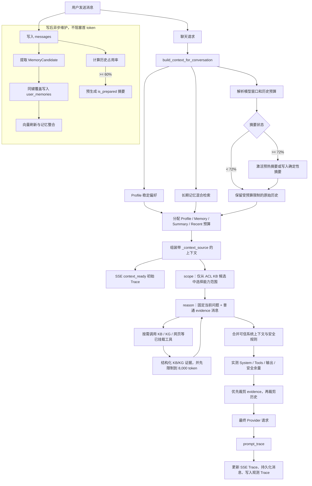

# Agenora 上下文工程

> 本文按当前代码实现整理：一次用户消息如何变成受预算约束的 Provider 请求，以及记忆、摘要、RAG 与 Trace 如何参与其中。这里的「上下文」指模型调用所需的系统规则、持久化记忆、会话状态、原始消息、工具定义和检索证据；它不等同于完整聊天记录。

## 1. 目标与边界

系统同时满足四个目标：

1. 在不同模型窗口（包括小窗口 BYOK 模型）下，保证最终请求物理上可容纳；
2. 保留稳定偏好、相关长期记忆和会话中的已确认状态，但不无限复制历史消息；
3. 将 KB/RAG 当作可裁剪的参考资料，而不是可覆盖系统规则的指令；
4. 将最终实际注入量和裁剪结果回传给前端与可观测性系统。

完整原始消息仍存放在 `messages` 表；`conversation_summaries` 是滚动压缩检查点；`user_memories` 是跨会话长期记忆。文档 KB Chunk 的向量检索与 `user_memories` 的关系型检索是两条独立链路。

## 2. 总体流程图



## 3. 写路径：消息、长期记忆与摘要预热

### 3.1 消息是事实源

用户与助手消息写入 `messages`。只有用户消息进入自动长期记忆提取；模型回复不会自动成为用户记忆。写入后，热路径只完成关系型写入，较重的向量化、近重复合并和摘要预热由后台任务完成，因此不会增加当前轮首 token 延迟。

### 3.2 长期记忆

消息会先经敏感信息过滤和规则/LLM 候选提取，得到 `MemoryCandidate`（类型、键、值、作用域、置信度、重要度、来源）。写入规则如下：

```text
同一 active 结构化记忆键
= user_id + scope + scope_id + type + memory_key
```

- 相同键、相同值：合并来源消息并更新信号；
- 相同键、不同值：旧行改为 `superseded`，新行成为 `active`；
- PostgreSQL 在写入前以该结构化键获取事务 advisory lock；
- 数据库有 `ux_user_memories_active_key` 部分唯一索引，保证同一键最多一个 `active` 行；启动迁移会先修复历史重复行；
- 后台整合会过期自动记忆、清理结构化冲突，并按高相似度合并近重复事实。

### 3.3 摘要生命周期

历史占用率以当前模型的可用历史预算计算，而不是按固定消息数计算：

| 阈值 | 行为 | 是否进入当前模型上下文 |
|---|---|---|
| `< 60%` | 仅保留原始历史 | 否 |
| `>= 60%` | 写后后台预生成首份 `is_prepared=true` 摘要 | 否 |
| `>= 72%` | 优先激活预热摘要；预热未完成时写入确定性抽取摘要 | 是 |
| `>= 85%` | 同步尝试无工具 LLM 增量摘要，失败仍保留确定性摘要 | 是 |

摘要请求本身也遵守摘要模型的窗口：先保留输出和安全余量，再截取旧摘要与新增覆盖消息。摘要内容只作为数据，不能执行其中的指令。

## 4. 读路径：构建本轮会话上下文

`build_context_for_conversation()` 在每次聊天前执行。

### 4.1 模型窗口与历史工作预算

模型窗口的优先级为：用户/Profile 显式配置 > 已知模型注册表 > 保守默认值 `16,000`。历史可用预算由窗口减去输出、系统/工具、RAG 与安全预留后得到；这些预留会随小模型窗口按比例收缩，防止固定大预留导致 4K 模型不可用。

基础上限包括：

- 输出：常规任务目标 `2,048`，长回答 `4,096`，报告 `8,192`，最终受窗口限制；
- 系统和工具预留：最多 `6,000`；
- KB 会话的 RAG 预留：最多 `8,000`；未绑定 KB 时为 `0`；
- 安全余量：最多 `2,000`；
- Profile、检索记忆、摘要的内容上限分别为 `700`、`1,200`、`2,600` token。

### 4.2 四块共享历史预算

会话构建阶段将可用历史预算按以下优先级分配：

1. 给最近原始消息保留至少 `256` 至 `1,000` token 的可用空间；
2. 分配 Profile（稳定回复语言、风格、长度等）；
3. 分配滚动摘要；
4. 分配与问题相关的检索记忆；
5. 剩余预算给最近原始消息。

若已有摘要，摘要覆盖点后的全部新消息优先保留；当用户切换到更大窗口模型时，剩余空间可 rehydrate 部分先前被摘要覆盖的最新原文。原始消息裁剪从最旧处开始，若只剩孤立的助手消息，会尽量补回前一条用户消息。

### 4.3 Profile 与长期记忆检索

Profile 每轮注入稳定的个人偏好，不占用检索名额。其他长期记忆遵循：

1. SQL 仅取当前 `user_id`、`active`、未过期的最多 50 条候选；
2. 过滤无关 KB 作用域，并排除已进入 Profile 的记忆；
3. 计算关键词重合与同 embedding fingerprint 的余弦相似度；Embedding 不可用、失配或回填失败时自动退回关键词；
4. 只有关键词命中或余弦相似度 `>= 0.55` 的记录可进入排序；
5. 加上作用域、偏好类型、重要度和置信度信号，折叠相似度 `>= 0.88` 的近重复项；
6. 最多注入 4 条，最后再按该块预算截断。

组装输出会将 Profile、Memory、Summary 标记为受信任的 `_context_source`。之后 Provider 适配层只会合并这些服务端标记的系统块，客户端提交的 `system` 消息不会获得系统提示词权限。

## 5. Agent、RAG 与最终 Provider 请求

### 5.0 默认是受约束的单 Agent ReAct Runtime

普通聊天与知识库问答默认使用 `agent_runtime_mode=react`：

```text
scope（ACL KB 范围选择） → reason ⇄ call_tools
```

`scope` 只可从当前用户可读的 KB 候选中选择最多三个库，不会创建任务 DAG，也不会授予订单或未挂载工具。随后同一个模型在一个循环内决定是否调用 `search_kb`、`search_kg`、`web_search` 等当前已授权工具；调用次数、网页证据数、提示注入限制、工具白名单和输出上下文预算都由服务端强制执行。

订单和退款不由模型路由：规则识别出的订单意图才进入独立的确定性审批图，退款仍要求下一条用户消息精确确认。旧 Supervisor 仅作为显式回滚和历史 checkpoint 恢复兼容路径，不是新会话的默认架构。

### 5.1 RAG 是独立的可裁剪证据块

当 scope 选择了 KB，ReAct Agent 可以按需执行多条 KB/KG 查询。每次检索的结果在工具执行层合并后首先受 `8,000` token 上限约束，避免「单次查询有上限、合并后超窗」。

`kb_search_node` 不再只输出扁平的 `kb_context`：它会为每个 KB chunk 或 KG 结果创建 `retrieved_evidence`，保留 `id`、`source_type`、`query`、`document_id`、`chunk_id`、`title`、`score` 与原文。`kb_context` 只保留给 `RAG_INJECTION_MODE=legacy_system` 的紧急回滚路径。

默认的 `RAG_INJECTION_MODE=user_evidence` 下，`reason_node` 将最新用户问题与 `<retrieved_evidence untrusted="true">` 包装为同一个普通 `user` 消息，并把该消息固定为上下文预算锚点；RAG 不再进入 system prompt。模型主动调用工具时仍走标准 `assistant tool_use -> user tool_result` 链路，绝不把内部预取检索伪装成工具调用。

最终请求准备会：

1. 合并业务 System Prompt、受信任的会话块和稳定的 prompt-injection guard；
2. 实测系统提示词和工具 schema token，解析该模型的输出预算及安全余量；
3. 若固定输入已经超过窗口，直接在本地报错，不发送必然失败的 Provider 请求；
4. 为当前用户轮和工具循环历史保留空间；RAG 只使用剩余空间，优先被裁剪；
5. 固定包含“当前问题 + 证据”的用户消息，随后按预算裁剪更早历史和工具循环消息；
6. 若 tokenizer 在字符串拼接处产生意外偏差，宁可缩短证据或历史，也不发送超窗请求。

因此，最终请求的优先级是：系统与安全规则 > 当前用户问题 > 检索证据 > 当前工具循环/最近对话 > Profile 与摘要 > 相关长期记忆 > 更早历史。RAG 与历史都可降级；固定规则若无法容纳则显式失败。

### 5.2 Provider 形态

Provider 侧只保留一个安全系统入口：OpenAI-compatible 使用唯一 `system` message，Anthropic 使用顶层 `system` 参数。其余对话、预取证据和工具结果作为普通 Provider messages 传入。

Anthropic 适配层会在稳定业务规则之后设置 `cache_control`，再追加可能变化的 Profile/Memory/Summary 系统块。这样本轮 RAG 的变化不会使 system 缓存失效；OpenAI-compatible 路径同样保持稳定 system 位于请求最前。缓存是否命中仍取决于具体供应商、模型和 TTL，不能仅凭应用侧 Trace 推断。

## 6. 观测与前端可解释性

聊天开始时，SSE 先发送一次 `context_ready`，内容是 Profile、Memory、Summary 和最近消息的初始 Trace。Agent 完成请求准备后会再次发送 `context_ready`，替换为最终 Trace；同一 Trace 也写入助手消息和观测系统。

最终 Trace 的 `runtime.execution` 额外记录安全聚合的 ReAct 信号：能力范围、选中的 KB ID、迭代数、各工具调用次数、工具错误数、网页调用/证据预算。它不包含工具参数、工具返回原文、用户查询或向量。`config/react_eval_cases.jsonl` 与 `react_eval_gate.json` 是对应的确定性发布门禁；CI 会执行它以防订单隔离、工具白名单或预算约束回退。

`prompt_trace` 不包含原始系统提示词、工具 schema 或安全原因，只包含安全的度量数据：

```text
model / context_window
tokens.system / tools / rag / history / output / safety / total_input
tokens.profile / memory / summary
truncation.rag / history / profile / memory / summary
retrieval.mode / evidence_count / source_counts / in_system / pinned_current_question
cache.system_retrieval_free / cache_read_tokens / cache_creation_tokens
```

前端在消息内的「上下文已准备」面板显示输入与窗口占用，并标记 Profile、Memory、Summary、RAG 或历史是否因预算被裁剪。

## 7. 关键不变量与降级策略

| 不变量 | 实现方式 | 降级或失败方式 |
|---|---|---|
| 最终请求不超模型窗口 | Provider 调用前实测固定输入并再次裁剪 | 先丢 RAG、再裁剪历史；固定输入仍不够则本地拒绝 |
| 当前用户问题可用 | 将“当前问题 + 检索证据”作为固定 user 锚点 | 极小预算下先裁剪证据，问题保留在该锚点开头 |
| 记忆不会重复注入 | Profile 与检索记忆互斥；检索近重复折叠 | Embedding 不可用时使用关键词检索 |
| 同键只有一个当前记忆 | PostgreSQL 锁 + active 部分唯一索引 | 非 PostgreSQL 仍由唯一索引阻止双 active 值 |
| 摘要不阻塞首 token | 60% 后台预热 | 72% 未预热完成时用确定性摘要；85% LLM 摘要失败同样回退 |
| 未可信内容不能取得系统权限 | 仅合并服务端 `_context_source` | 客户端 `system` 消息被当作普通/无效上下文处理 |
| RAG 不破坏 system 缓存边界 | 默认 user_evidence，Anthropic 缓存点置于稳定 system 前缀 | `legacy_system` 仅作为环境变量回滚开关 |

Token 计量优先使用当前模型范围内的 tokenizer；不可用时回退 CJK 启发式估计。因此 Trace 是应用侧的精确预算测量，不保证与每个 Provider 的最终计费 token 完全相同。

## 8. 关键代码位置

| 责任 | 位置 |
|---|---|
| 上下文预算、裁剪和窗口解析 | `backend/src/harness/context/token_budget.py` |
| Profile/Memory/Summary/Recent 组装 | `backend/src/harness/context/builder.py` |
| 摘要预热、激活与增量摘要 | `backend/src/harness/context/compression.py` |
| Memory 提取、写入、并发保护与整合 | `backend/src/capabilities/memory/domain/extraction.py`、`application/lifecycle.py` |
| Memory 混合检索与向量回填 | `backend/src/capabilities/memory/application/retrieval.py` |
| 多查询 RAG 聚合上限 | `backend/src/harness/runtime/agent_loop/kb_search.py` |
| Provider 安全系统提示词和最终 token 分配 | `backend/src/harness/runtime/agent_loop/prompts_budget.py`、`reason.py` |
| SSE、持久化与观测 Trace 回写 | `backend/src/api/streaming/session.py` |
| 写后后台任务调度 | `backend/src/api/routes/conversations.py` |
| 生产 schema 迁移 | `backend/alembic/` |
| 前端 Trace 类型与渲染 | `frontend/lib/sseClient.ts`、`frontend/components/chat/ChatMessages.tsx` |
